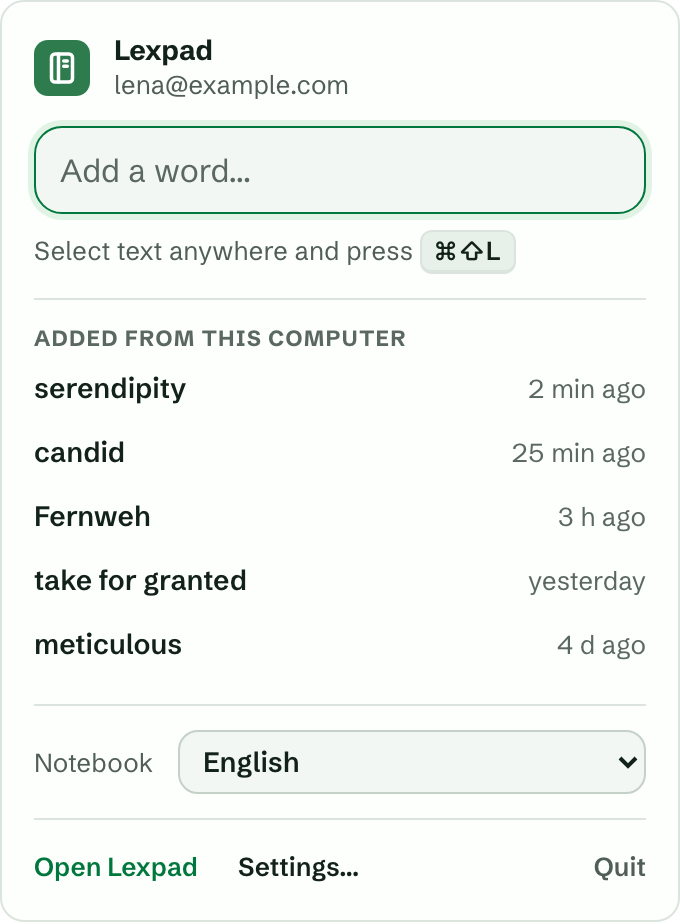
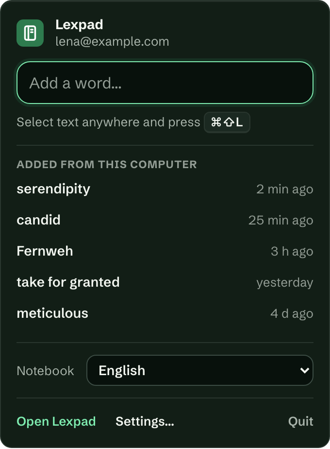
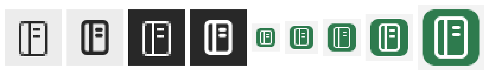

# Lexpad for macOS and Windows

Add the words you meet in **any** app to your [Lexpad](https://lexpad.app) notebook.

Select a word in a document, an e-mail, a PDF or a chat, press **⌘⇧L** on a Mac or
**Ctrl+Shift+L** on Windows, and a small card shows its part of speech, level, pronunciation
and up to three meanings with examples. Press **Enter** to add it, **Esc** to close. The sentence
you met it in is kept as its first example, and a private note says where: "Seen in Microsoft
Word". Nothing selected? A small box lets you type the word. Selected a whole sentence? Pick the
word out of it, and the sentence comes along.

Lexpad lives in the menu bar (macOS) or the system tray (Windows), starts when you log in (you
can turn that off), and runs once. From 0.2 it is also the whole Lexpad app in a window of its
own: Today, practice (offline too), the notebook, Lex, Progress and Settings. Click its icon for a small panel: type a word to add it, see
your shortcut, the last words you added from this computer (click one to open it in Lexpad),
pick the notebook new words go to, and Open Lexpad, Settings or Quit. Esc or a click elsewhere
closes it. Right-click the icon for a short menu with the same three actions.

| Light                                                 | Dark                                                |
| ----------------------------------------------------- | --------------------------------------------------- |
|  |  |

The icons: 

Lexpad never asks for your password: you allow it from Lexpad in your browser, and it appears
under Settings → Signed-in devices as "Desktop app", where it can be signed out on its own.

On macOS there is also **Services → Add to Lexpad** when you right-click a selection.

## What leaves your computer

- When you look a word up: the word, and the sentence it was in as a hint for the meaning.
- When you add it: the word, its meaning, that sentence as an example, and the private note
  "Seen in <app name>".
- Never a window title (they carry document names, e-mail subjects and the names of people you
  chat with), never the rest of the text, never anything you did not select. The selection is
  read only at the moment you press the shortcut.

On macOS, reading another app's selection needs the **Accessibility** permission (System
Settings → Privacy & Security → Accessibility). Lexpad explains this and opens the right pane;
without it you can still type a word. Where an app does not share its selection, Lexpad copies
it (⌘C / Ctrl+C) and then puts your clipboard back exactly as it was.

## Changelog

**0.2.2** (8 October 2026)

- In the window, going back from a word puts the notebook where you left it: the same words on
  screen, with your search, filters and Show switches as they were (from tester feedback). Today,
  Progress and Settings keep their place on the way back too.

**0.2.1** (8 October 2026)

- The window carries the web app's new sidebar: a clear Add a word button at the top, and it
  remembers whether it is folded or open on this computer.

**0.2.0** (8 October 2026)

- **The whole Lexpad app in a window of its own**: Today, practice, the notebook, Lex, Progress and
  Settings, the same app as on the web and Android, bundled with the app (not loaded from the
  web). Practice works offline and catches up when the connection is back. Open it from the
  panel or the tray menu (Open Lexpad), the Dock, a word in the panel, or at start; Settings can
  send Open Lexpad to the browser instead. The window keeps its size and place.
- It signs in through your browser, like the rest of the app (Google and Apple accounts work),
  and the app's core keeps the only session: the window never holds a token.
- **This computer** in the app's Settings: the shortcut, the notebook it adds to, reading the
  selection, notifications, start-up and the version.
- **Notifications on this computer**: your daily reminder (from your account's reminder time,
  with real counts) and Lexpad's messages such as a gift. A click opens the window.
- After an update, macOS may stop applying the Accessibility permission while the switch still
  looks on; Lexpad now says so and how to fix it.

**0.1.1** (7 October 2026)

- The card always opens wholly on the screen, on the monitor under the pointer: never under the
  menu bar, the Dock or the Windows taskbar (on any edge), below and to the right of the pointer
  or above and to the left where there is no room. It stays on the screen when it grows as the
  meanings arrive, and a card taller than the screen scrolls with Add and Cancel still showing.
- Drag the card by its header to move it; the next shortcut opens it near the pointer again.
- The menu-bar / tray panel keeps to the screen the same way.
- Windows: the card and the panel are placed by what you see, not by the window's invisible
  border, at any display scaling and with monitors left of or above the main one.

**0.1.0** (7 October 2026): first beta. The shortcut and the card, the Services menu on macOS,
the menu-bar / tray panel, Settings, and signing in through the browser.

## Develop

Needs Node 22, pnpm 9 and Rust (stable). Rust was installed with the official installer into
the user's home, with no sudo and no change to the shell profile:

```
curl --proto '=https' --tlsv1.2 -sSf https://sh.rustup.rs | sh -s -- -y --no-modify-path --profile minimal -c rustfmt -c clippy
export PATH="$HOME/.cargo/bin:$PATH"          # in each shell, or add it yourself
rustup target add x86_64-apple-darwin          # for universal macOS builds on Apple silicon
```

```
corepack enable pnpm
pnpm install
pnpm app:dev        # run against production (api.lexpad.app, app.lexpad.app)
pnpm check          # prettier, tsc, vitest, vite build, rustfmt, clippy, cargo test
```

Against a local stack (the API and the web app from `lexpad_back` and `lexpad_front`; the API's
`CORS_ALLOWED_ORIGINS` must include the web app's origin):

```
LEXPAD_API_ORIGIN=http://localhost:8091 LEXPAD_APP_ORIGIN=http://localhost:4173 pnpm tauri build --bundles app
open src-tauri/target/release/bundle/macos/Lexpad.app
```

A development build keeps its session in its own Keychain entry and never adds itself to the
login items. Icons are drawn by `pnpm icons` from the Lexpad mark (the landing site's
`favicon-v2.svg`): the app icon, the macOS menu-bar template at 1x and 2x, and the Windows
`tray.ico` (16, 20, 24, 32 and 48 px). `python3 scripts/icons.py --preview` also writes
`docs/screenshots/tray-icons.png`.

Screenshots of the panel (`docs/screenshots/`) are drawn from the built page in Chromium, with a
sample account that lives only in the script:

```
pnpm build && node scripts/panel-screenshots.mjs ../front/node_modules/.pnpm/playwright@1.62.1/node_modules/playwright/index.mjs
```

Conventions and rules are in `CLAUDE.md`.

## Release

`pnpm tauri build` makes, unsigned for now:

| Platform | Output                                                                                 |
| -------- | -------------------------------------------------------------------------------------- |
| macOS    | `Lexpad.app` and `Lexpad_<version>_universal.dmg` (`--target universal-apple-darwin`)  |
| Windows  | `Lexpad_<version>_x64-setup.exe` (NSIS, per-user) and `Lexpad_<version>_x64_en-US.msi` |

GitHub Actions (`.github/workflows/build.yml`) runs the gate on Linux on every push and pull request
(`pnpm check`, plus clippy for the Windows target). It builds the Windows installers only for a
release: on a `v*` tag, or by hand (`gh workflow run build`). macOS is built on the Mac, not in CI:
this repository is private, and a macOS runner minute is billed as ten (Windows as two), so one CI
macOS build cost about as much as a week of the API's deploys.

### Release steps

1. Bump `version` in `package.json` and `src-tauri/Cargo.toml`, commit, and tag it:
   `git tag v<version> && git push origin main v<version>`.
2. **Windows**: the tag runs CI's `release-windows` job (clippy and tests on Windows, the NSIS
   `.exe` and `.msi`, a silent install and start, the placement smoke test). Download the
   `lexpad-desktop-Windows` artifact from the run (`gh run download <run id>`); it is kept 14 days.
3. **macOS**: on the Mac, from the tagged commit, `scripts/release-mac.sh`. It builds the universal
   `.app` and `.dmg` against production (it refuses `LEXPAD_API_ORIGIN`/`LEXPAD_APP_ORIGIN` and a
   dirty tree), checks the `.dmg` holds `Lexpad.app` with both architectures and the right version,
   runs the placement smoke test, and prints the `.dmg`'s SHA-256.
4. Put both on the landing's downloads page (`lexpad_landing`) with their SHA-256s, and the
   release in the changelog.

Still to do before a public release (marked `TODO(signing)` in the workflow for Windows and in
`scripts/release-mac.sh` for macOS):

- **macOS signing and notarization.** Needs the Apple Developer Team ID and a "Developer ID
  Application" certificate. Then set `bundle.macOS.signingIdentity` (or `APPLE_SIGNING_IDENTITY`)
  and the notarization secrets (`APPLE_API_KEY`/`APPLE_API_ISSUER`, or `APPLE_ID`/`APPLE_PASSWORD`/
  `APPLE_TEAM_ID`); `tauri build` signs and notarizes when they are present. Until then a
  downloaded build must be opened with right-click → Open, and macOS asks again for
  Accessibility after every rebuild because the unsigned app's identity changes.
- **Windows signing.** An Authenticode certificate or Azure Trusted Signing
  (`bundle.windows.signCommand`), or SmartScreen warns on install.
- **Microsoft Store (later).** The Store takes an MSIX package or, since 2023, a signed
  `.exe`/`.msi` installer submitted as a Win32 app. The simplest route is to submit the signed
  NSIS installer; an MSIX needs a packaging step (MSIX Packaging Tool or `makeappx`) with the
  Store's publisher identity. Needs a Partner Center account.
- **Updater.** Off in 0.1 (no `tauri-plugin-updater`). Turn it on with a signing key pair and an
  update endpoint before 1.0.
- **Mac App Store** is not planned: it forbids reading other apps' selections through the
  Accessibility API, which is the point of the app. (The app also uses Tauri's
  `macos-private-api` for the panel's transparent, rounded window, which the store refuses too.)

## Manual test on Windows

Windows cannot be run from the Mac this was built on; CI builds it. Before a Windows release,
go through `docs/windows-manual-test.md`.
